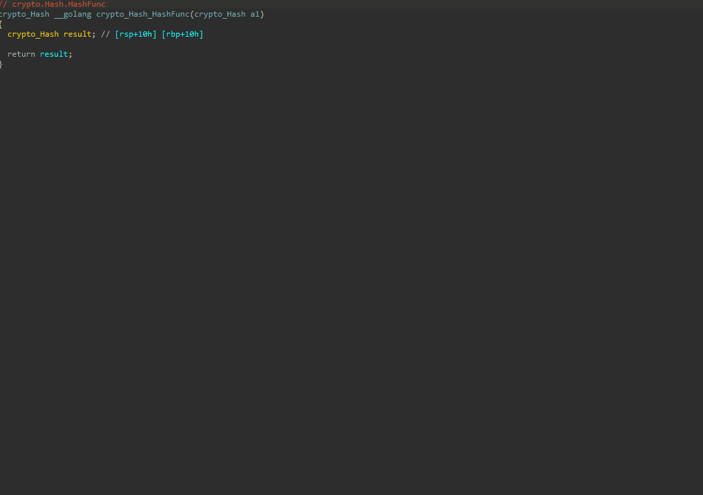

# GoFastAnalyzer
Go fastcall analysis for ida decompiler

## Installation
Put the GoAnalyzer.py and GoAnalyzer dir in your plugins directory

## Motivation
Currently, IDA Pro doesn't detect the new [Go internal abi](https://github.com/golang/go/blob/master/src/cmd/compile/abi-internal.md)
which is the new way of calling functions in go since go 1.17 good enough

This new calling convention uses registers instead of the stack to pass parameters
However IDA detects the convention as __golang convention which passes parameters on the stack,  
which makes the decompilation look confusing

In newer versions of IDA the __golang is defined in the registers we take this into consideration, and use this new feature

## Features
### Main features
* If IDA detected the function prototype, specify the correct usercall using the compiler's logic for passing the arguments
* If IDA didn't detect the function prototype, specify a guessed usercall by using the stack extension block logic
### Misc features
* xmm15 is used as a 16 byte zero as specified in the internal abi
  - using microcode we can fix it
* r14 is used as the current go routine as specified in the internal abi
  - using microcode we can show its usage like NtCurrentTeb in window
* analyze string sizes and define them correctly
* analyze calls to runtime functions which receive RTYPE struct and override their parameter types

## Example
### Without using the plugin

### With using the plugin

## Contribution
Any contribution to the repository is welcome

## License
[MIT](https://choosealicense.com/licenses/mit/)
